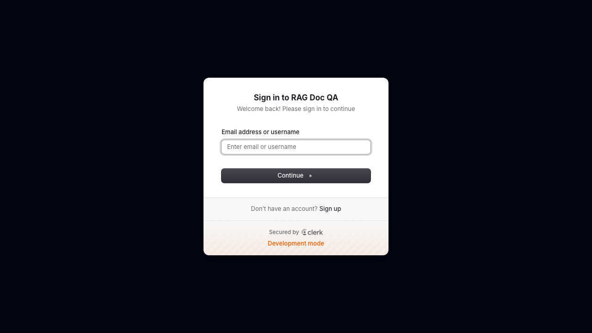
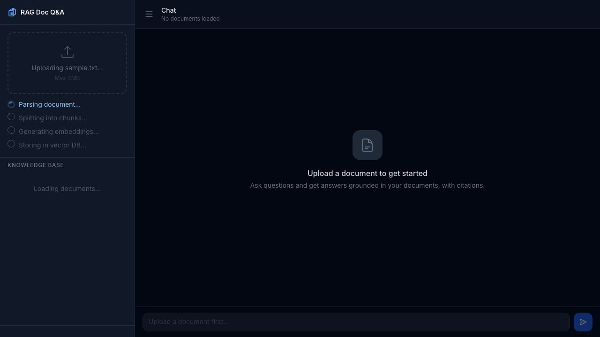
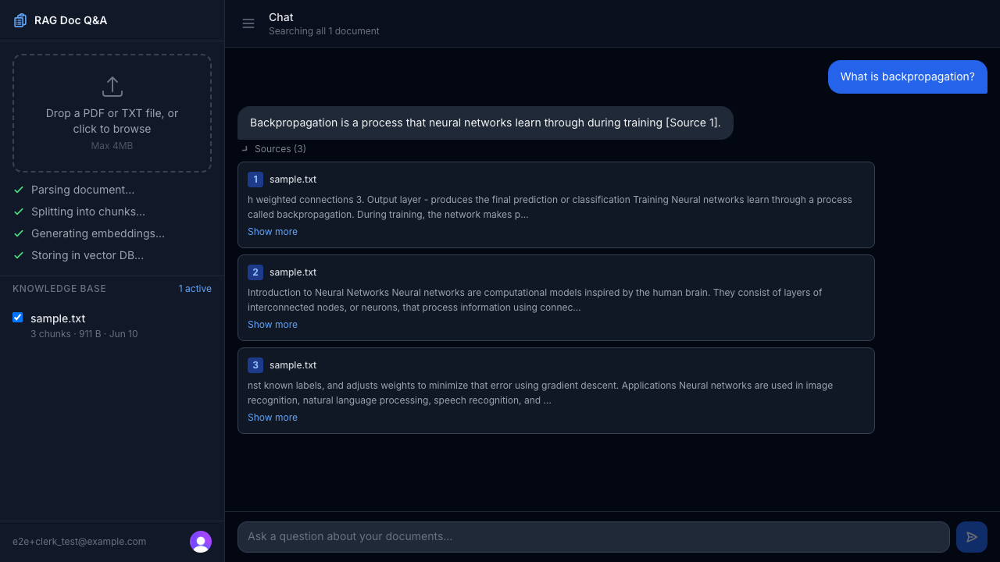

# RAG Document Q&A

A full-stack Retrieval-Augmented Generation (RAG) app that lets you upload documents and ask questions grounded in their content — with source citations for every answer.

**Live demo:** [rag-doc-qa-five.vercel.app](https://rag-doc-qa-five.vercel.app)


---

## What is RAG?

RAG is a technique that combines a vector search step with an LLM call. Instead of asking the model to answer from memory (which leads to hallucinations), you:

1. **Chunk** the document into overlapping segments
2. **Embed** each chunk into a high-dimensional vector
3. **Store** those vectors in a database that supports similarity search
4. At query time, **embed the question** and find the most semantically similar chunks
5. **Inject those chunks** into the prompt as context, constraining the model to answer only from them
6. **Stream the answer** back with citations pointing to the exact source chunks

This pipeline is the foundation of most enterprise AI knowledge base products.

---

## Screenshots

<table>
  <tr>
    <td width="33%"></td>
    <td width="33%"></td>
    <td width="33%"></td>
  </tr>
  <tr>
    <td align="center"><sub><b>Secure sign-in</b><br/>Clerk auth — no idle pausing</sub></td>
    <td align="center"><sub><b>Live ingestion pipeline</b><br/>parse → chunk → embed → store</sub></td>
    <td align="center"><sub><b>Grounded answers</b><br/>expandable <code>[Source N]</code> citations</sub></td>
  </tr>
</table>

> Every answer is constrained to the retrieved chunks — expand **Sources** to see the exact passages each claim came from. Try it on the [live demo](https://rag-doc-qa-five.vercel.app).

---

## Tech Stack

| Layer | Technology | Why |
|---|---|---|
| Framework | Next.js 15 (App Router) | Full-stack, streaming support, Vercel-native |
| Language | TypeScript | Type safety across the pipeline |
| Styling | Tailwind CSS | Utility-first, no runtime overhead |
| Auth | Clerk | Free tier (10k MAU), drop-in Next.js components, no idle pausing |
| Vector DB | Neon Postgres + pgvector | Free tier, SQL-native, `<=>` cosine distance; scales to zero but auto-wakes (no keepalive needed) |
| Embeddings | HuggingFace Inference API (`all-MiniLM-L6-v2`) | Free, 384-dim vectors, strong semantic similarity |
| LLM | Groq (`llama-3.1-8b-instant`) | Free tier, extremely fast inference |
| Streaming | Vercel AI SDK (`streamText` + `useChat`) | First-class SSE streaming in Next.js |
| PDF parsing | `unpdf` | WASM-based, works in serverless without `fs` hacks |

**No LangChain or LlamaIndex.** The chunker, embedder, and retriever are implemented from scratch — which is the point of this project.

---

## Architecture

```
┌──────────────────────────────────────────────────────────────┐
│                        INGESTION PIPELINE                    │
│                                                              │
│  Upload   →   Parse   →   Chunk   →   Embed   →   Store     │
│  (file)     (unpdf)    (chunker)   (HF API)   (pgvector)    │
└──────────────────────────────────────────────────────────────┘

┌──────────────────────────────────────────────────────────────┐
│                         QUERY PIPELINE                       │
│                                                              │
│  Question → Embed → Retrieve → Augment prompt → Stream LLM  │
│            (HF API) (pgvector)  (+ citations)   (Groq)      │
└──────────────────────────────────────────────────────────────┘
```

### Key files

```
lib/
├── rag/
│   ├── chunker.ts      # Recursive sentence-aware text splitter
│   ├── embedder.ts     # HuggingFace batched embedding with cold-start retry
│   ├── retriever.ts    # pgvector cosine similarity search via the match_chunks SQL function
│   └── pipeline.ts     # Ingest orchestrator (parse → chunk → embed → store)
├── parsers/pdf.ts      # unpdf wrapper with page-number tracking
└── groq.ts             # Prompt construction with [Source N] citation format

app/api/
├── upload/route.ts     # POST: ingestion entry point (60s timeout)
├── chat/route.ts       # POST: RAG query + Groq streaming
└── documents/
    ├── route.ts        # GET: list user's documents
    └── [id]/route.ts   # DELETE: remove document + cascade chunks
```

### Chunking strategy

Rather than splitting on a fixed character count, the chunker uses a **recursive separator hierarchy**:

```
paragraph breaks → line breaks → sentence endings → words → characters
```

Chunks are 512 characters with 100-character overlap to preserve context across boundaries. Each chunk tracks its source page number for accurate citations.

### Similarity search

The database exposes a `match_chunks` SQL function that runs cosine distance search via pgvector:

```sql
1 - (c.embedding <=> query_embedding) as similarity
```

An IVFFlat index (`lists=100`) makes this sub-millisecond at scale.

### Citations

Retrieved chunks are serialized to JSON, base64-encoded (to handle non-ASCII characters), and sent back in the `X-Citations` response header alongside the streamed answer. The client reads them in the AI SDK's `onResponse` callback and associates them with the completed message.

---

## Database Schema

```sql
documents (id, name, size_bytes, mime_type, user_id, created_at)
chunks    (id, document_id, content, chunk_index, page_number, token_count, embedding vector(384))
```

`documents.user_id` holds the Clerk user ID. Ownership is enforced in the application layer: every query is scoped by `user_id`, and the `match_chunks` retrieval function takes the authenticated user's ID so similarity search can never return another user's chunks — even if the client tampers with the requested document IDs.

---

## Local Setup

### Prerequisites

- Node.js 18+
- A [Neon](https://neon.tech) Postgres project (free)
- A [Clerk](https://clerk.com) application (free)
- A [Groq](https://console.groq.com) API key (free)
- A [HuggingFace](https://huggingface.co/settings/tokens) API token (free)

### 1. Clone and install

```bash
git clone https://github.com/connorkoch0511/RAG-Doc-QA.git
cd RAG-Doc-QA
npm install
```

### 2. Set up the database (Neon)

1. Create a project at [neon.tech](https://neon.tech) (pgvector is available by default)
2. Open the **SQL Editor** and run the migration:
   - `db/migrations/001_schema.sql`
3. Copy the connection string from **Connection Details** — you'll use it as `DATABASE_URL`

### 3. Set up auth (Clerk)

1. Create an application at [clerk.com](https://clerk.com) and enable **Email + Password**
2. Copy the **Publishable key** and **Secret key** from the API Keys page

### 4. Configure environment variables

```bash
cp .env.example .env.local
```

Edit `.env.local`:

```env
DATABASE_URL=postgresql://...neon.tech/neondb?sslmode=require
NEXT_PUBLIC_CLERK_PUBLISHABLE_KEY=pk_test_...
CLERK_SECRET_KEY=sk_test_...
GROQ_API_KEY=gsk_...
HUGGINGFACE_API_TOKEN=hf_...
```

> **Note:** `CLERK_SECRET_KEY` and `DATABASE_URL` are server-only — never prefix them with `NEXT_PUBLIC_`.

### 5. Run

```bash
npm run dev
```

Open [http://localhost:3000](http://localhost:3000).

---

## Running Tests

The test suite uses [Playwright](https://playwright.dev) and covers auth flows, document upload with pipeline progress, Q&A with citations, document selection, and delete.

```bash
# Run all tests (requires dev server running or will start one)
npm test

# Run with Playwright's interactive UI
npm run test:ui
```

Screenshots from each test step are saved to `e2e/screenshots/`.

---

## Deployment

The app is configured for [Vercel](https://vercel.com). Push to `main` and it deploys automatically.

Set the same environment variables in **Vercel → Settings → Environment Variables**. (Neon is also available as a [Vercel Marketplace](https://vercel.com/marketplace) integration, which auto-populates `DATABASE_URL`.)

---

## Known Limitations

- **File size:** Vercel's Hobby plan limits request bodies to ~4.5MB, so documents must be under 4MB.
- **HuggingFace cold starts:** The free inference API may take 10–20 seconds to warm up after a period of inactivity. The embedder retries automatically.
- **No PDF scanned images:** `unpdf` extracts text only. PDFs that are scanned images with no text layer will produce empty content.
